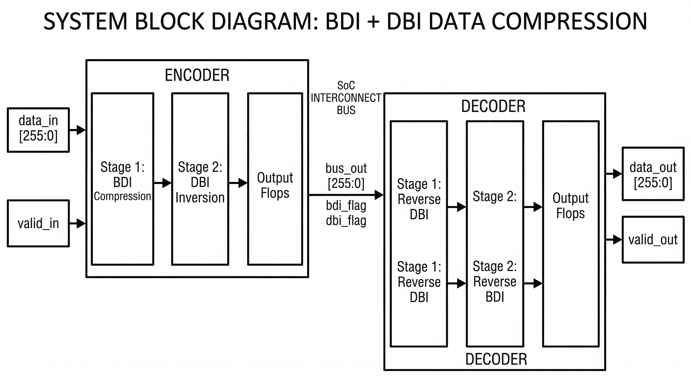

# Interconnect-Data-Compression
Team ID : 44 , Problem Statement number : 10
# SoC Interconnect Data Compression (BDI + DBI)

---

## 📌 Problem Statement
**Specification:** Implement a lossless hardware encoder/decoder pair for an SoC interconnect to reduce bus toggling and data width.

**Objective:** Modern System-on-Chip (SoC) interconnects consume significant power due to wide data buses and high toggle rates. This project implements a two-stage lossless compression and encoding pipeline to minimize both the effective data width and the number of bit transitions on the interconnect highway.

---

## 1. Project Overview 

Modern System-on-Chip (SoC) interconnects route massive amounts of data across silicon, consuming significant dynamic power. Dynamic power dissipation in CMOS circuits is governed by the equation:

$$P_{dynamic} = \alpha \cdot C \cdot V_{DD}^2 \cdot f$$

Where the switching activity (toggle rate), $\alpha$, represents how often physical wires flip between logic `0` and logic `1`. 

**Objective:** This project implements a fully synthesizable, lossless hardware encoder/decoder pair. By combining **Base-Delta-Immediate (BDI)** compression with **Data Bus Inversion (DBI)**, this module minimizes the toggle rate on a 256-bit wide data bus, effectively reducing the dynamic power consumed by the interconnect highway without losing data fidelity.

---

## 🏗️ Architecture Overview

The design consists of two main hardware modules (`bdi_dbi_encoder` and `bdi_dbi_decoder`) that execute a two-stage data transformation pipeline on a 256-bit wide data bus. 

### Stage 1: Base-Delta-Immediate (BDI) Compression
* The 256-bit input is treated as eight 32-bit words.
* **Base Value:** The first word (`data_in[31:0]`) acts as the base value.
* **Delta Calculation:** The hardware calculates the difference between the base and the remaining seven words.
* **Compression:** If all seven differences fit within a 7-bit signed integer range (-64 to +63), the bus is successfully compressed. The `bdi_flag` is asserted, and the output is packed with the base value and the seven 7-bit deltas, effectively masking the upper bits to zero to save dynamic power.

### Stage 2: Data Bus Inversion (DBI)
* The hardware counts the number of '1's in the 256-bit BDI-processed data.
* If the number of '1's exceeds 128 (more than 50% of the bus width), the entire 256-bit data is bitwise inverted.
* The `dbi_flag` is asserted alongside the data to tell the decoder to re-invert the data upon reception, significantly reducing the toggle rate on the physical bus lines.

---
